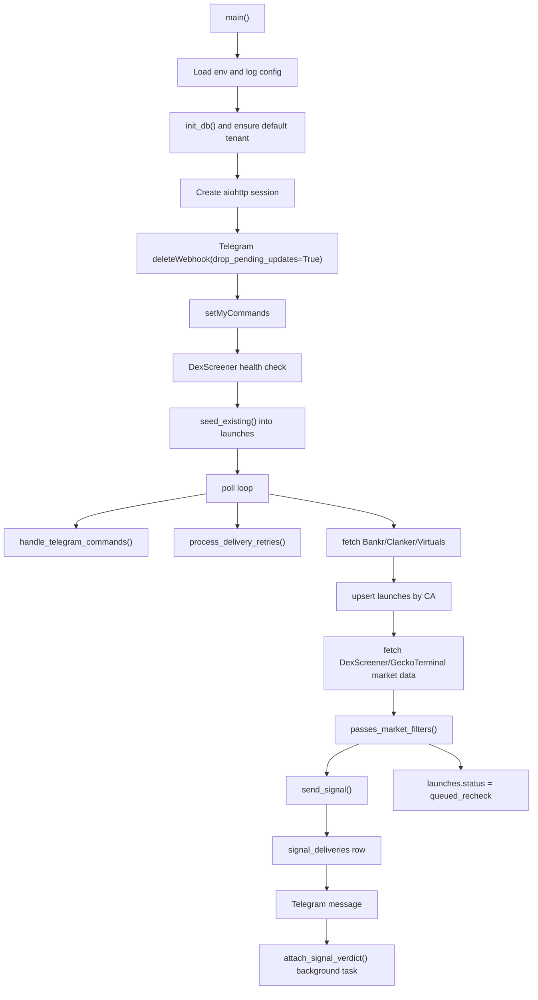
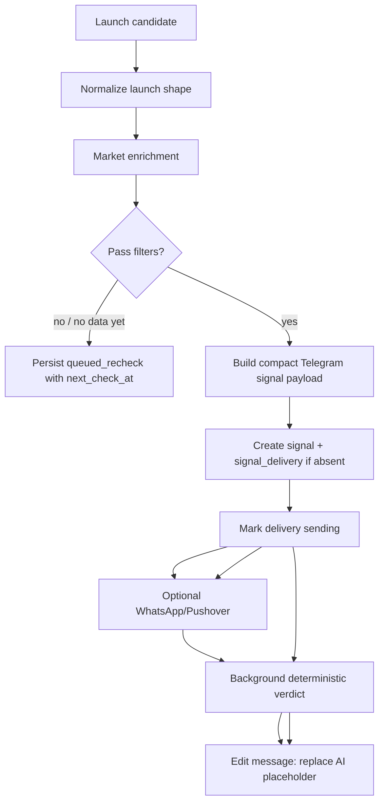

# Architecture

## Purpose

`bankr-Xlaunches-alerts` is a Python Telegram bot for early-stage Base token monitoring.
It watches launch sources, enriches candidates with market and social data, filters noise,
and sends compact Telegram signals with research actions and a deterministic AI-brief
placeholder.

The bot is currently optimized for research and alerting. Trading code exists, but real
on-chain execution is fail-closed by default.

## Runtime Stack

| Area | Technology |
| --- | --- |
| Language | Python 3.12.3 |
| Async runtime | `asyncio` |
| HTTP client | `aiohttp` |
| Telegram integration | Telegram Bot HTTP API |
| Persistence | SQLAlchemy 2 async ORM |
| Local database | SQLite via `aiosqlite`, WAL enabled |
| Production database target | Postgres via `asyncpg` |
| Migrations | Alembic |
| Queue foundation | Redis + RQ job skeleton |
| Configuration | `pydantic-settings` + `.env.local` |
| Optional on-chain wallet/trading | `web3.py` on Base |
| Deployment process | `Procfile`: `worker: python main.py` |
| Local run mode | detached `screen` session `bankr_alerts` with `.env.local` |

Core dependencies:

```text
aiohttp>=3.9.0
web3>=6.0.0
SQLAlchemy>=2.0.0
aiosqlite>=0.20.0
asyncpg>=0.29.0
alembic>=1.13.0
pydantic-settings>=2.2.0
redis>=5.0.0
rq>=2.0.0
```

## Repository Layout

```text
main.py                       Main bot runtime, polling, commands, formatting, integrations
database.py                   Async SQLAlchemy schema, engine/session, repository helpers
settings.py                   Typed environment settings and DB URL resolution
research_pipeline.py          Deterministic auto-verdict scoring and formatting
trader.py                     Optional on-chain buy/sell helpers, disabled by default
worker.py                     RQ-compatible enrichment worker skeleton
maintenance.py                Retention cleanup job entrypoint
services/                     Import-safe service boundaries for delivery, tenants, queueing, logs
migrations/                   Alembic environment and initial service schema migration
tests/                        Phase 1 smoke tests for persistence and delivery invariants
README.md                     Setup and environment overview
architecture.md               This architecture document
Procfile                      Worker entrypoint for Railway-like deployments
runtime.txt                   Python runtime version
data/accounts.txt             Watched influencer/account list
data/high_priority.txt        High-priority watched accounts
docs/integration_review.md    Prior integration plan/review
docs/telegram_ux_review.md    Telegram signal UX direction
```

Runtime-generated local files:

```text
blocklist.json                Blocked X accounts, local or /data on hosted deployments
data/tracked_wallets.json     User-tracked wallets, local or /data on hosted deployments
bot.log                       Local screen-session log file
```

## Main Components

### `main.py`

Owns the running bot process:

- Reads environment configuration.
- Starts Telegram long polling.
- Clears pending Telegram updates on startup with `deleteWebhook(drop_pending_updates=True)`.
- Polls launch sources.
- Enriches tokens with DexScreener/GeckoTerminal market data.
- Applies market/source filters.
- Sends Telegram alerts and optional WhatsApp/Pushover notifications.
- Handles Telegram commands and inline callbacks.
- Builds Telegram signal UI and research-first inline keyboard.

Key runtime state:

- `launches`: durable CA-level dedupe and recheck status in the database.
- `signals`: one product-level signal row per CA.
- `signal_deliveries`: tenant/channel delivery ledger with Telegram message ids, retry status and payload.
- `tenants` / `tenant_settings`: Telegram user/group destinations and future plan/filter settings.
- `provider_cooldowns`: DB-visible degraded state for external API 429s.
- `follower_cache`: SocialData follower lookup cache.
- `gecko_cache`: market data cache.
- `_address_map`: maps shortened callback addresses to full contract addresses.

`main.py` still owns the single-process local runtime, but product state is no longer
owned by process memory. Restart-safe behavior is enforced through `database.py`
repository helpers and uniqueness constraints.

### `database.py`

Owns the Phase 1 service foundation:

- Async engine/session lifecycle.
- SQLite local auto-create and WAL mode.
- Postgres-compatible ORM schema.
- Repository functions for tenant upsert, launch CA dedupe, persistent rechecks,
  signal creation, per-tenant delivery dedupe, delivery retry state, provider cooldowns,
  verdict cache, audit events and DB-backed status snapshots.

Main models:

```text
Tenant, User, TenantMember, TenantSettings
Launch, Verdict, VerdictCache
Signal, SignalDelivery
ProviderCooldown, ApiBudgetEvent, AuditEvent, BotState
```

Critical uniqueness:

```text
tenants(type, external_id)
launches(ca)
signals(ca)
signal_deliveries(signal_id, tenant_id, channel)
```

### Services

Import-safe modules under `services/` keep future workers from importing `main.py`:

- `services.delivery`: single-tenant delivery preparation and 1000-tenant fanout row creation.
- `services.tenants`: Telegram tenant bootstrap.
- `services.queueing`: Redis/RQ queue helpers with deterministic job ids.
- `services.observability`: JSON event logging and correlation ids.
- `services.research_pipeline`: Phase 2 token research persistence and deterministic feature extraction.
- `services.spoof_detector`: Phase 2 spoof/ticker-reuse/fake-volume heuristics.
- `services.verdict_v2`: Phase 2 structured 0-100 verdict scoring.
- `services.ai_summary`: AI-summary cache with a deterministic stub provider.
- `services.token_intelligence`: Phase 2 aggregator for research, spoof signals, verdict and summary.

### Phase 2 Intelligence Layer

Phase 2 adds persistent research and verdict tables without replacing Phase 1 delivery
state:

```text
token_research       idempotent research pipeline status and evidence
historical_launches  ticker/deployer history for spoof and reuse checks
spoof_signals        persisted deterministic spoof/risk signals
verdict_v2           versioned structured verdicts with 0-100 score
ai_summaries         cached human summaries; provider is currently stub
```

Telegram commands:

- `/verdict2 0xCONTRACT`
- `/spoof-check 0xCONTRACT`
- `/summary 0xCONTRACT`

The AI layer is intentionally not connected yet. The current summary is a deterministic
stub built from collected evidence, so it does not make unsupported claims.

### `research_pipeline.py`

Builds deterministic research verdicts for signals:

- Scores market data, deployer identity, notable X mentions, and watched influencer mentions.
- Uses a semaphore controlled by `AUTO_VERDICT_MAX_CONCURRENT`.
- Caches verdicts by token address for 15 minutes.
- Formats a concise `AI brief (deterministic)` block.

This module does not call an LLM yet. It provides the slot and shape for a future AI summary.

### `trader.py`

Contains optional Uniswap V3 SwapRouter buy/sell helpers on Base.

Current safety posture:

- `ALLOW_UNSAFE_TRADING=false` by default.
- `buy_token()` and `sell_token()` return an error unless `ALLOW_UNSAFE_TRADING=true`.
- The existing unsafe path still uses `amountOutMinimum=0`; it must not be enabled until
  quote/minOut protection, nonce serialization, and async-safe execution are implemented.

## External Services

### Launch Sources

| Source | Endpoint | Usage |
| --- | --- | --- |
| Bankr | `https://api.bankr.bot/token-launches` | Primary Base launchpad source |
| Clanker | `https://www.clanker.world/api/tokens` | Base launchpad source |
| Virtuals | `https://api2.virtuals.io/api/virtuals` | Virtuals agent launches |

### Market Data

| Source | Endpoint | Usage |
| --- | --- | --- |
| DexScreener | `https://api.dexscreener.com/token-pairs/v1/base/{token}` | Primary market data |
| GeckoTerminal | `https://api.geckoterminal.com/api/v2` | Fallback and `/research` search |

Market data is normalized into:

```python
{
    "mcap": float,
    "volume_24h": float,
    "liquidity": float,
    "price_usd": str,
    "price_change_1h": float,
    "price_change_24h": float,
    "pair_url": str,
    "pair_created_at": int,
    "token_name": str,
    "token_symbol": str,
    "dex_id": str,
    "_source": str,
}
```

GeckoTerminal has an in-process rate limiter and a cooldown after HTTP 429.

### Social/X Research

| Source | Usage |
| --- | --- |
| SocialData | Follower lookup, notable X mentions, recent ticker/contract tweets |
| `data/accounts.txt` | Watched influencer accounts |
| `data/high_priority.txt` | High-priority watched accounts |

Signal buttons include:

- `X Research`: direct X search URL for contract OR ticker.
- `Ticker X`: bot-side recent ticker/contract search through SocialData.
- `Copy CA`: sends the full contract address.

### Notifications

| Channel | Status |
| --- | --- |
| Telegram | Primary channel |
| WhatsApp via Whapi | Optional |
| Pushover | Optional emergency-style alert |

### Optional Execution

| Integration | Status |
| --- | --- |
| Bankr Agent API | Optional `AUTO_EXECUTE`, currently off locally |
| On-chain Uniswap V3 execution | Present in `trader.py`, fail-closed |
| Banana Gun | External Telegram deep link button only |

## Telegram UX

Current signal structure:

```text
📡 $SYMBOL · Token Name
Source · @deployer

📊 Snapshot
├ MCap ... · Vol ... · Liq ...
└ 1h ... · Age ...

🎯 Why surfaced
└ concise deterministic reason

🧠 AI brief (placeholder)
├ source/age/data status
└ next check

🔗 Gecko · GMGN · Source/Tweet · Uniswap
CA
/research CA
```

After deterministic verdict enrichment, the placeholder is replaced with:

```text
🧠 AI brief (deterministic) · LABEL score/10
├ Why: strongest reasons
├ Risk: strongest risks
└ X: strongest social signal
```

Keyboard order is research-first:

1. X Research
2. Gecko / GMGN
3. Copy CA / Ticker X
4. Banana Gun

## Filtering Model

Configurable thresholds:

- `MIN_FOLLOWERS`
- `MIN_MCAP`
- `MIN_VOLUME_24H`
- `MIN_LIQUIDITY`
- `MAX_TOKEN_AGE`

Safe launchpads:

```text
bankr, clanker, virtuals
```

For safe launchpads, liquidity filtering is skipped because the bot treats them as
launchpad/bonding-curve sources. For DEX-discovered or unknown sources, liquidity is part
of the filter.

Tokens with missing or not-yet-sufficient market data are stored as `launches.status =
queued_recheck` with `next_check_at`, `check_count`, `no_data` and the last market
snapshot. This survives restarts and can be selected with Postgres `SKIP LOCKED` when
recheck workers are split out.

## Telegram Commands

General:

- `/start`
- `/help`
- `/status`
- `/test`

Research:

- `/research $TICKER`
- `/research 0xCONTRACT`
- `/r $TICKER`

Wallet tracking:

- `/track 0xADDRESS [label]`
- `/untrack 0xADDRESS`
- `/wallets`

Moderation:

- `/block @username`
- `/unblock @username`
- `/blocklist`

Trading/admin-gated:

- `/wallet`
- `/buy 0xADDRESS 20`
- `/sell 0xADDRESS 50`

Trading commands require `TRADING_ENABLED=true` and an authorized `TRADER_USER_IDS` match.

## Environment Variables

Required for core bot:

```text
TELEGRAM_BOT_TOKEN
TELEGRAM_CHAT_ID
SOCIALDATA_API_KEY
```

Access control:

```text
AUTHORIZED_USER_IDS       Comma-separated Telegram user IDs allowed to DM commands
TRADER_USER_IDS           Comma-separated Telegram user IDs allowed to use trading commands
TRADER_USER_ID            Legacy single-user fallback
```

Filters:

```text
MIN_FOLLOWERS             default 5000
RESEARCH_MIN_FOLLOWERS    default 1000
RESEARCH_HIGH_SIGNAL_SCORE default 8
MIN_MCAP                  default 50000
MIN_VOLUME_24H            default 30000
MIN_LIQUIDITY             default 30000
MAX_TOKEN_AGE             default 4h
POLL_INTERVAL             default 30s
```

Auto-verdict:

```text
AUTO_VERDICT_ENABLED      default true
AUTO_VERDICT_TIMEOUT_SEC  default 12
AUTO_VERDICT_MAX_CONCURRENT default 2
```

Market data runtime:

```text
GECKO_COOLDOWN_SEC        default 60
```

Optional notifications:

```text
WHAPI_TOKEN
WHATSAPP_GROUP_ID
PUSHOVER_USER_KEY
PUSHOVER_API_TOKEN
```

Optional Bankr API execution:

```text
AUTO_EXECUTE              default false
BANKR_EXECUTION_API_KEY
BANKR_BUY_AMOUNT          default 100
```

Optional on-chain trading:

```text
TRADING_ENABLED           default false
ALCHEMY_RPC_URL
PRIVATE_KEY
ALLOW_UNSAFE_TRADING      default false, should remain false for now
SLIPPAGE_BPS              default 1000, currently not enough protection by itself
```

## Startup Flow



## Signal Flow



## Security And Safety Notes

- Telegram trading is fail-closed unless `TRADER_USER_IDS` is configured.
- Stale Telegram updates are dropped on startup.
- Trade commands/callbacks have freshness checks.
- Telegram message formatting escapes external/user-derived values where signal output is built.
- On-chain trading remains disabled by default because the current unsafe path does not yet
  implement reliable quote/minOut protection.
- `.env.local` and secrets should not be committed.

## Known Gaps / Next Work

- Connect a real AI model behind the existing `AI brief` slot.
- Add a SocialData request budget/cache beyond the current follower cache.
- Split `main.py` into clearer modules once behavior stabilizes.
- Implement safe on-chain trading before enabling `ALLOW_UNSAFE_TRADING`.
- Add tests for signal formatting, verdict formatting, and filter behavior.
- Decide whether text links should be reduced further now that inline buttons carry most actions.
