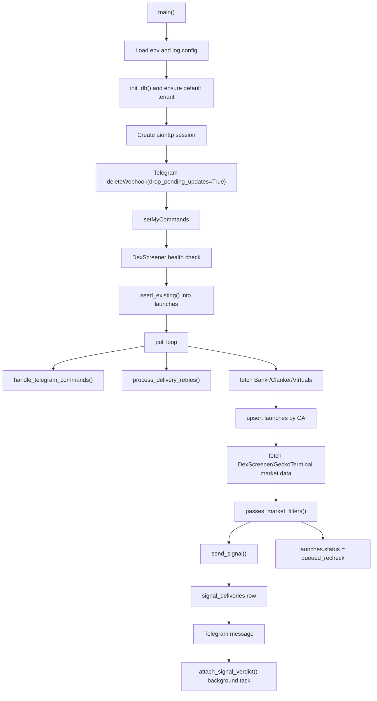
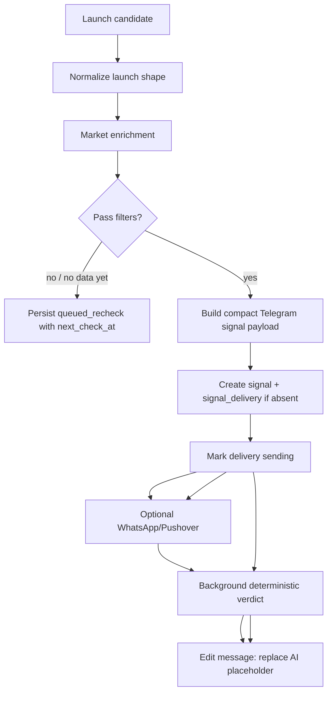

# Architecture

## Purpose

`bankr-Xlaunches-alerts` is a Python Telegram bot for early-stage Base token monitoring.
It watches launch sources, enriches candidates with market and social data, filters noise,
and sends compact Telegram signals with research actions and a deterministic AI-brief
placeholder.

The bot is currently optimized for research and alerting. Trading code exists, but real
on-chain execution is fail-closed by default.

## Runtime Stack

| Area | Technology |
| --- | --- |
| Language | Python 3.12.3 |
| Async runtime | `asyncio` |
| HTTP client | `aiohttp` |
| Telegram integration | Telegram Bot HTTP API |
| Persistence | SQLAlchemy 2 async ORM |
| Local database | SQLite via `aiosqlite`, WAL enabled |
| Production database target | Postgres via `asyncpg` |
| Migrations | Alembic |
| Queue foundation | Redis + RQ job skeleton |
| Configuration | `pydantic-settings` + `.env.local` |
| Optional on-chain wallet/trading | `web3.py` on Base |
| Deployment process | `Procfile`: `worker: python main.py` |
| Local run mode | detached `screen` session `bankr_alerts` with `.env.local` |

Core dependencies:

```text
aiohttp>=3.9.0
web3>=6.0.0
SQLAlchemy>=2.0.0
aiosqlite>=0.20.0
asyncpg>=0.29.0
alembic>=1.13.0
pydantic-settings>=2.2.0
redis>=5.0.0
rq>=2.0.0
```

## Repository Layout

```text
main.py                       Main bot runtime, polling, commands, formatting, integrations
database.py                   Async SQLAlchemy schema, engine/session, repository helpers
settings.py                   Typed environment settings and DB URL resolution
research_pipeline.py          Deterministic auto-verdict scoring and formatting
worker.py                     RQ-compatible enrichment worker skeleton
maintenance.py                Retention cleanup job entrypoint
services/                     Import-safe service boundaries for delivery, tenants, queueing, logs
migrations/                   Alembic environment and initial service schema migration
tests/                        Phase 1 smoke tests for persistence and delivery invariants
README.md                     Setup and environment overview
architecture.md               This architecture document
Procfile                      Worker entrypoint for Railway-like deployments
runtime.txt                   Python runtime version
data/accounts.txt             Watched influencer/account list
data/high_priority.txt        High-priority watched accounts
docs/integration_review.md    Prior integration plan/review
docs/telegram_ux_review.md    Telegram signal UX direction
```

Runtime-generated local files:

```text
blocklist.json                Blocked X accounts, local or /data on hosted deployments
data/tracked_wallets.json     Legacy tracked-wallet import file; runtime tracking is DB-backed
bot.log                       Local screen-session log file
```

## Main Components

### `main.py`

Owns the running bot process:

- Reads environment configuration.
- Starts Telegram long polling.
- Clears pending Telegram updates on startup with `deleteWebhook(drop_pending_updates=True)`.
- Registers any private `/start` user as an active Telegram tenant.
- Polls launch sources.
- Enriches tokens with DexScreener/GeckoTerminal market data.
- Applies market/source filters.
- Sends Telegram alerts and optional WhatsApp/Pushover notifications.
- Handles Telegram commands and inline callbacks.
- Builds Telegram signal UI and research-first inline keyboard.

Key runtime state:

- `launches`: durable CA-level dedupe and recheck status in the database.
- `signals`: one product-level signal row per CA.
- `signal_deliveries`: tenant/channel delivery ledger with Telegram message ids, retry status and payload.
- `tenants` / `tenant_settings`: Telegram user/group destinations and future plan/filter settings.
- `provider_cooldowns`: DB-visible degraded state for external API 429s.
- `follower_cache`: SocialData follower lookup cache.
- `gecko_cache`: market data cache.
- `_address_map`: maps shortened callback addresses to full contract addresses.

`main.py` still owns the single-process local runtime, but product state is no longer
owned by process memory. Restart-safe behavior is enforced through `database.py`
repository helpers and uniqueness constraints.

### `database.py`

Owns the Phase 1 service foundation:

- Async engine/session lifecycle.
- SQLite local auto-create and WAL mode.
- Postgres-compatible ORM schema.
- Repository functions for tenant upsert, launch CA dedupe, persistent rechecks,
  signal creation, per-tenant delivery dedupe, delivery retry state, provider cooldowns,
  verdict cache, audit events and DB-backed status snapshots.

Main models:

```text
Tenant, User, TenantMember, TenantSettings
Launch, Verdict, VerdictCache
Signal, SignalDelivery
ProviderCooldown, ApiBudgetEvent, AuditEvent, BotState
UserWatchlist, UserFeedback
TrackedWallet, WalletEvent
```

Critical uniqueness:

```text
tenants(type, external_id)
launches(ca)
signals(ca)
signal_deliveries(signal_id, tenant_id, channel)
```

### Services

Import-safe modules under `services/` keep future workers from importing `main.py`:

- `services.delivery`: signal-level delivery fanout and delivery ledger creation.
- `services.tenants`: Telegram tenant bootstrap with self-serve DM defaults.
- `services.queueing`: Redis/RQ queue helpers with deterministic job ids.
- `services.observability`: JSON event logging and correlation ids.
- `services.research_pipeline`: Phase 2 token research persistence and deterministic feature extraction.
- `services.spoof_detector`: Phase 2 spoof/same-ticker collision, fake-volume, thin-liquidity, paid-attention and flow-imbalance heuristics.
- `services.verdict_v2`: Phase 2 structured 0-100 verdict scoring and compact Telegram AI brief output.
- `services.ai_summary`: AI-summary cache with a deterministic stub provider.
- `services.token_intelligence`: Phase 2 aggregator for research, spoof signals, verdict and summary.

### Phase 2 Intelligence Layer

Phase 2 adds persistent research and verdict tables without replacing Phase 1 delivery
state:

```text
token_research       idempotent research pipeline status and evidence
historical_launches  ticker/deployer history for spoof and reuse checks
spoof_signals        persisted deterministic spoof/risk signals
verdict_v2           versioned structured verdicts with 0-100 score
ai_summaries         cached human summaries; provider is currently stub
user_watchlists      per-tenant watched Base contracts and last market snapshot
user_feedback        per-tenant Worth watching / Skip feedback for future ranking
tracked_wallets      per-tenant Base wallets watched for smart-money confirmation
wallet_events        idempotent ERC-20 transfer/event ledger for tracked wallets
```

Phase 4 wallet tracking is feature-flagged with `WALLET_MONITOR_ENABLED=false` by
default. `/track`, `/untrack` and `/wallets` are DB-backed now. When enabled with a Base
Alchemy RPC URL, the bot polls ERC-20 transfers for tracked wallets and stores matching
events in `wallet_events`. Recent tracked-wallet inflow/outflow is copied into
`token_research.processed_data.smart_money` and can boost/risk-adjust Verdict 2.0 output.

Same-ticker collision is intentionally narrow: it only flags other Base contracts with the
same normalized ticker when they are fresh under `MAX_TOKEN_AGE` and independently pass
the active market filters. The Telegram AI brief shows this as one short risk line, while
`/spoof_check` can inspect the stored evidence.

Telegram commands:

- `/start`
- `/help`
- `/status`
- `/research $TICKER`
- `/research 0xCONTRACT`
- `/verdict2 0xCONTRACT`
- `/spoof_check 0xCONTRACT`
- `/summary 0xCONTRACT`

The AI layer is intentionally not connected yet. The current summary is a deterministic
stub built from collected evidence, so it does not make unsupported claims.

Current research evidence stored in `token_research.processed_data`:

- normalized source metadata: source method, deployer wallet, X handle, website/tweet, description
- normalized market snapshot: mcap, 24h volume, liquidity, age, pair URL/address, DEX, transaction flow
- deterministic flags: DexScreener discovery, paid attention, unresolved owner, fresh pair, volume/liquidity and mcap/liquidity stretch
- on-chain placeholders for wallet profile, bundle analysis and holder distribution

### Legacy `research_pipeline.py`

The root-level `research_pipeline.py` is the older social/X research module. Phase 2
token intelligence is now orchestrated by `services.token_intelligence` and the
`services/*` modules listed above.

The legacy module still:

- Scores market data, deployer identity, notable X mentions, and watched influencer mentions.
- Uses a semaphore controlled by `AUTO_VERDICT_MAX_CONCURRENT`.
- Caches verdicts by token address for 15 minutes.
- Formats the compact `AI brief` placeholder used before Verdict 2.0 enrichment.

This module does not call an LLM yet. It provides the slot and shape for a future AI summary.

## External Services

### Launch Sources

| Source | Endpoint | Usage |
| --- | --- | --- |
| Bankr | `https://api.bankr.bot/token-launches` | Primary Base launchpad source |
| Clanker | `https://www.clanker.world/api/tokens` | Base launchpad source |
| DexScreener | `https://api.dexscreener.com/token-profiles/latest/v1`, `token-boosts/latest/v1`, `community-takeovers/latest/v1` | Base DEX discovery source |
| CoinGecko Onchain | `https://api.coingecko.com/api/v3/onchain/networks/base/new_pools` | Base new-pools DEX discovery source |
| Virtuals | `https://api2.virtuals.io/api/virtuals` | Virtuals agent launches |

Bankr currently exposes the 50 most recent launches; `offset` is not treated as a
reliable pagination contract. Clanker uses offset pagination with `limit=10`,
`sortBy=deployed-at`, `sort=desc`, `includeUser=true`, `includeMarket=false`, and
`chainId=8453` for Base.
DexScreener discovery is filtered to `chainId=base`, deduped by token CA, then enriched
with `https://api.dexscreener.com/tokens/v1/base/{tokenAddresses}` in batches of up to 30.
CoinGecko discovery is polled conservatively through Demo API auth with
`x-cg-demo-api-key`; local defaults cap it to one Base `new_pools` call every 720 seconds
(5 calls/hour, about 3.6k calls/month). It is a gap-filler source: if Bankr, Clanker or
DexScreener already inserted the CA, the DB dedupe skips the CoinGecko duplicate; otherwise
the Base pool is added to the normal filter/recheck pipeline.
Unlike Bankr/Clanker/Virtuals, DexScreener and CoinGecko are not safe launchpad sources,
so liquidity filtering stays enabled.

### Market Data

| Source | Endpoint | Usage |
| --- | --- | --- |
| DexScreener | `https://api.dexscreener.com/token-pairs/v1/base/{token}` | Primary market data |
| GeckoTerminal | `https://api.geckoterminal.com/api/v2` | Fallback and `/research` search |

Market data is normalized into:

```python
{
    "mcap": float,
    "volume_24h": float,
    "liquidity": float,
    "price_usd": str,
    "price_change_1h": float,
    "price_change_24h": float,
    "pair_url": str,
    "pair_created_at": int,
    "token_name": str,
    "token_symbol": str,
    "dex_id": str,
    "_source": str,
}
```

GeckoTerminal has an in-process rate limiter and a cooldown after HTTP 429.

### Social/X Research

| Source | Usage |
| --- | --- |
| SocialData | Follower lookup, notable X mentions, recent ticker/contract tweets |
| `data/accounts.txt` | Watched influencer accounts |
| `data/high_priority.txt` | High-priority watched accounts |

Signal buttons include:

- `X Research`: direct X search URL for contract OR ticker.
- `Ticker X`: bot-side recent ticker/contract search through SocialData.
- `Copy CA`: sends the full contract address.

### Notifications

| Channel | Status |
| --- | --- |
| Telegram | Primary channel |
| WhatsApp via Whapi | Optional |
| Pushover | Optional emergency-style alert |

## Telegram UX

Current signal structure:

```text
🚨 New Launch SOURCE

Token Name - $SYMBOL

🕐 Launched: age
•💰 Market Cap.: ...
•📈 Volume: ...
•💧 Liquidity: ...
•🟢 1h: ...

🔗 DexScreener · GMGN · Tweet · Uniswap

🧠 AI brief (placeholder)
• Type of token
• Owner
• Product
• Focus
• Risks

CA
/research CA
```

After deterministic verdict enrichment, the placeholder is replaced with:

```text
🧠 AI brief · Score score/10 · LABEL
• Type
• Owner
• Product
• Focus
• Risks

Split: Market 0/30 · Deployer 0/25 · Social 0/30 · Risk 0/10 · Narrative 0/5
```

Keyboard order is research-first:

1. X Research
2. Worth watching / Skip

## Filtering Model

Configurable thresholds:

- `MIN_FOLLOWERS`
- `MIN_MCAP`
- `MIN_VOLUME_24H`
- `MIN_LIQUIDITY`
- `MAX_TOKEN_AGE`

Safe launchpads:

```text
bankr, clanker, virtuals
```

For safe launchpads, liquidity filtering is skipped because the bot treats them as
launchpad/bonding-curve sources. For DEX-discovered or unknown sources, liquidity is part
of the filter.

Tokens with missing or not-yet-sufficient market data are stored as `launches.status =
queued_recheck` with `next_check_at`, `check_count`, `no_data` and the last market
snapshot. This survives restarts and can be selected with Postgres `SKIP LOCKED` when
recheck workers are split out.

## Telegram Commands

General:

- `/start` — registers the private chat as an active DM tenant and shows the English introduction.
- `/help`
- `/status`

Research:

- `/research $TICKER`
- `/research 0xCONTRACT`
- `/r $TICKER`
- `/verdict2 0xCONTRACT`
- `/spoof_check 0xCONTRACT`
- `/summary 0xCONTRACT`

Retention:

- `/watch 0xCONTRACT [label]`
- `/unwatch 0xCONTRACT`
- `/watchlist`
- `/settings`
- `/settings min_score 7.5`

Admin-only:

- `/test`
- `/track 0xADDRESS [label]`
- `/untrack 0xADDRESS`
- `/wallets`
- `/block @username`
- `/unblock @username`
- `/blocklist`

## Environment Variables

Required for core bot:

```text
TELEGRAM_BOT_TOKEN
SOCIALDATA_API_KEY
```

Optional default destination:

```text
TELEGRAM_CHAT_ID          Default group/chat tenant; public DM subscriptions work without it
```

Access control:

```text
AUTHORIZED_USER_IDS       Comma-separated Telegram user IDs allowed to admin commands
```

Filters:

```text
MIN_FOLLOWERS             default 5000
RESEARCH_MIN_FOLLOWERS    default 1000
RESEARCH_HIGH_SIGNAL_SCORE default 8
MIN_MCAP                  default 50000
MIN_VOLUME_24H            default 30000
MIN_LIQUIDITY             default 30000
MAX_TOKEN_AGE             default 4h
POLL_INTERVAL             default 30s
```

Auto-verdict:

```text
AUTO_VERDICT_ENABLED      default true
AUTO_VERDICT_TIMEOUT_SEC  default 12
AUTO_VERDICT_MAX_CONCURRENT default 2
```

Market data runtime:

```text
GECKO_COOLDOWN_SEC        default 60
WATCHLIST_CHECK_INTERVAL  default 900
WATCHLIST_CHECK_BATCH     default 100
WATCHLIST_NOTIFY_MCAP_CHANGE_PCT default 50
WATCHLIST_NOTIFY_VOLUME_CHANGE_PCT default 100
WALLET_MONITOR_ENABLED default false
WALLET_POLL_INTERVAL    default 60
WALLET_POLL_BATCH       default 50
WALLET_LOOKBACK_BLOCKS  default 1200
```

Optional notifications:

```text
WHAPI_TOKEN
WHATSAPP_GROUP_ID
PUSHOVER_USER_KEY
PUSHOVER_API_TOKEN
```

Wallet monitoring:

```text
ALCHEMY_RPC_URL           Required only when WALLET_MONITOR_ENABLED=true
```

## Startup Flow



## Signal Flow



## Security And Safety Notes

- Stale Telegram updates are dropped on startup.
- Telegram message formatting escapes external/user-derived values where signal output is built.
- Trading/execution code is intentionally not part of the bot runtime.
- `.env.local` and secrets should not be committed.

## Known Gaps / Next Work

- Connect a real AI model behind the existing `AI brief` slot.
- Add a SocialData request budget/cache beyond the current follower cache.
- Split `main.py` into clearer modules once behavior stabilizes.
- Add tests for signal formatting, verdict formatting, and filter behavior.
- Decide whether text links should be reduced further now that inline buttons carry most actions.
